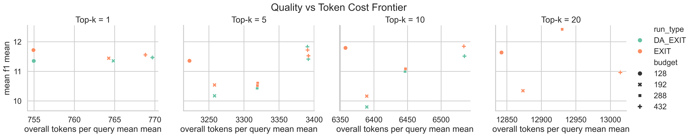
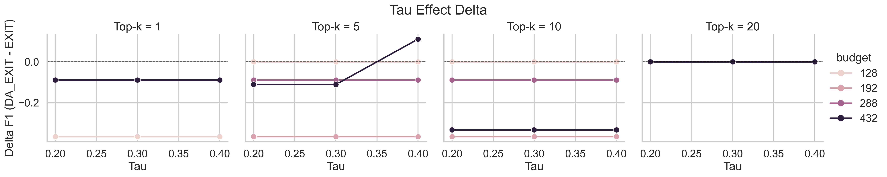
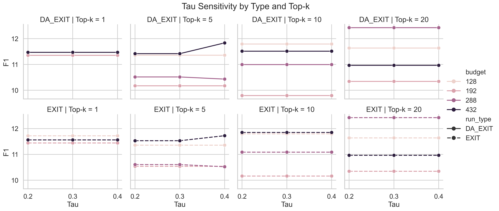
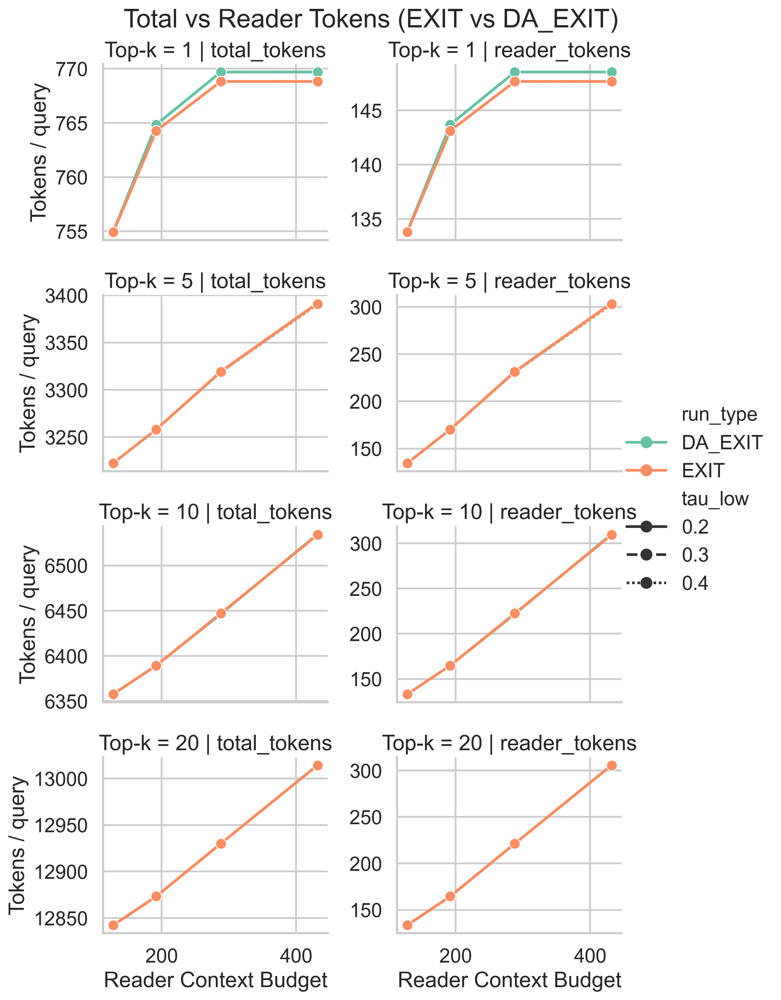
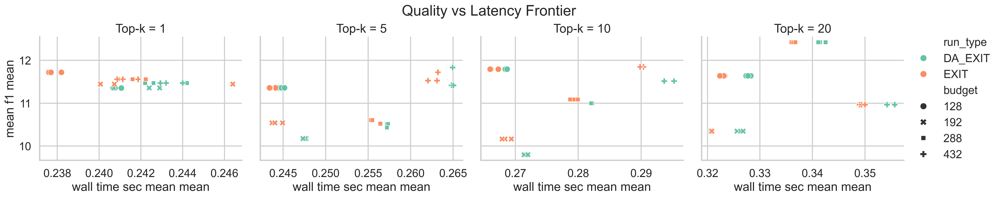

# Discourse-aware EXIT

A discourse-aware retrieval and reasoning pipeline for question answering, based on the work in [this paper](https://arxiv.org/pdf/2412.12559).

The purpose of this project is to 'compress' the amount of information sent to the reader model, providing it with more precise, specific information. A lightweight LoRa is trained to identify useful sentences. At runtime, such sentences are extracted, reranked according to how useful the LoRa considers them to be, and then sent to a more heavy-duty reader model. The aim is to reduce compute by passing the reader model fewer sentences, while retaining accuracy.

The LoRa is trained on MuSiQue passages, and current benchmarking is only done on that dataset. All functionality is included in the codebase to train a new LoRa on a different dataset, and to assess performance on that dataset. There is currently functionality for a number of datasets besides MuSiQue. MuSiQue was chosen because it is on the more complex side of QA datasets, requiring reasoning that may benefit more from discourse-aware sentence extraction.


## Discourse-aware Expansion

In the Discourse-aware EXIT pipeline, discourse-aware expansion is triggered by explicit marker detection so the selected evidence can be made more self-contained before sending to the reader. Marker matching is implemented with regex-based lexical cues and sentence-position constraints. The marker groups used are:

- Strong backward (sentence-initial) connectives: `however`, `nevertheless`, `nonetheless`, `still`, `instead`, `otherwise`, `therefore`, `thus`, `hence`, `consequently`, `as a result`, `moreover`, `furthermore`
- Backward/parenthetical connectives: `however`, `yet`, `whereas`, `therefore`, `thus`
- Forward/example cues: `for example`, `for instance`, `such as`, `namely`, `specifically`, `in particular`
- Reformulation cues: `in other words`, `i.e.`, `put differently`
- Temporal cues: `then`, `meanwhile`, `afterwards`, `previously`, `subsequently`
- Conditional cues: `otherwise`, `in that case`

These cues help identify discourse dependencies (backward references, forward elaborations, reformulations, and parentheticals) and construct expanded sentences that preserve local context across sentence boundaries. The hypothesis was that this explicit contextualisation would improve downstream extraction and QA quality.


## Experimental Results Summary

This section details the performance and efficiency evaluation of the Discourse-aware EXIT pipeline compared to the standard EXIT baseline. To ensure statistical reliability and account for variance, all reported metrics (including F1 scores, latency, and token consumption) are averaged across 3 independent random seeds.

### 1. Insignificance of Expanded Sentences

Despite the added context from anaphora resolution, results show that expanded sentences have an insignificant impact on overall quality. As seen in the Quality vs Token Cost Frontier and Tau Effect Delta plots, the difference in mean F1 scores between Discourse-aware EXIT and baseline EXIT is negligible. In most configurations, the delta (Discourse-aware EXIT - EXIT) is at or slightly below zero, indicating that the baseline is already robust enough to infer context without explicit sentence-level expansion.





### 2. The Effect of Tau

Tau (`tau`) is the sentence-usefulness threshold applied after LoRA scoring. The selected sweep `0.2, 0.3, 0.4` is intentional:

- `tau=0.2` (lower): recall-oriented setting, keeps more candidate sentences and reduces false negatives at the cost of more noise/tokens
- `tau=0.3` (centre): the model-selected operating point from training (`best_metrics.json` reports optimal `tau ~= 0.30`, with strong dev precision/recall balance)
- `tau=0.4` (higher): precision-oriented setting, keeps fewer high-confidence sentences and reduces noise at the risk of dropping useful evidence

This low/optimal/high triad probes the precision-recall trade-off around the learned operating point without over-expanding the experiment grid. Empirically, the Tau Sensitivity chart shows nearly flat F1 trajectories across these values for most budget and Top-k settings, indicating limited sensitivity in final QA quality despite threshold shifts. One hypothesis was that higher tau values would pair especially well with the Discourse-aware expansion — stricter filtering could be offset by the added contextual cues, preserving evidence quality while reducing noise. However, the results do not support this: F1 remains flat across tau values regardless of whether expansion is applied, suggesting that the discourse-aware component does not meaningfully interact with the precision-recall trade-off controlled by tau.



### 3. The Effect of Budget

The reader context budget governs token consumption and strongly influences task performance. As shown in Total vs Reader Tokens, overall tokens per query scale with the allocated budget. Moving from lower to higher budgets generally improves F1. However, this quality gain shows diminishing returns at higher budget tiers, where increased token cost and slight latency bumps do not translate into proportional accuracy gains.





## Future Work

- Evaluate Discourse-aware EXIT on additional QA datasets with different discourse profiles, especially corpora that contain a higher density and diversity of connectives, reformulations, and long-distance references.


## Installation

1. Create a virtual environment:
   ```bash
   python -m venv .venv
   ```

2. Activate the environment:
   - On Windows: `.venv\Scripts\Activate.ps1`
   - On Unix/Mac: `source .venv/bin/activate`

3. Install dependencies:
   ```bash
   pip install -r requirements.txt
   python -m spacy download en_core_web_sm
   ```

   Note: For GPU support with FAISS, install `faiss-gpu` manually if needed.


## Usage

The pipeline consists of the following scripts, to be run in order:

1. **dataset_preprocessing.py**: Preprocess raw datasets from `data/raw_datasets/{dataset}/` into QA/passages JSONL files in `data/processed_datasets/{dataset}/{split}/`.
2. **build_representations.py**: Build dense/sparse passage representations from the processed data, saving to `data/representations/datasets/{dataset}/{split}/`.
3. **DA_EXIT.py**: Run the main discourse-aware retrieval and reasoning pipeline using the processed data and representations.
4. **baseline_embeddings_RAG.py**: Run a baseline Retrieval-Augmented Generation pipeline for comparison using the same data.

## Requirements

- Python 3.8+
- Dependencies listed in `requirements.txt`

